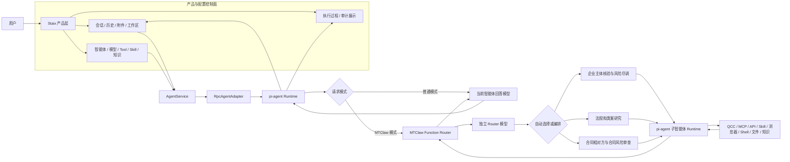
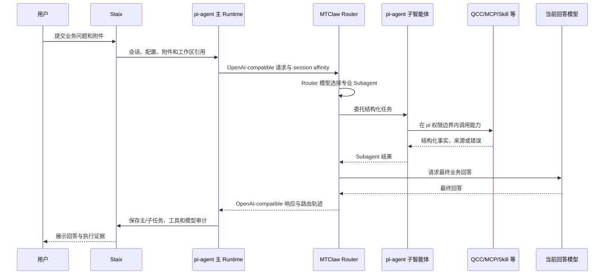
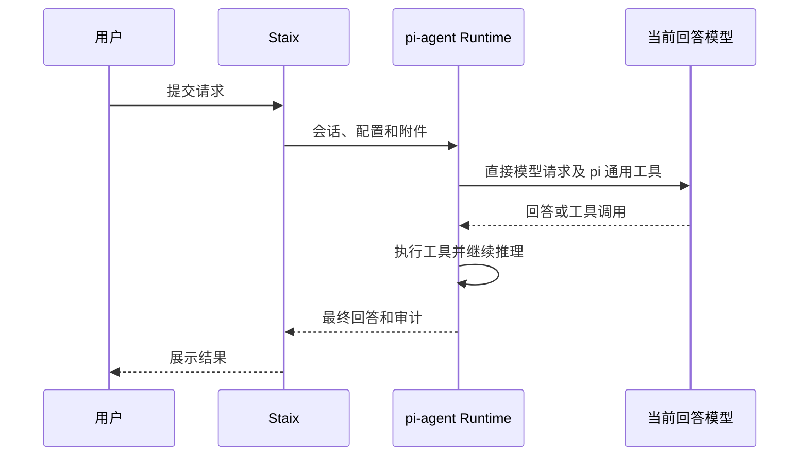

# HICOOL MTClaw 产品架构与执行流

## 1. 架构原则

本项目不是用 MTClaw 替换 Staix 或 pi-agent，而是在现有产品与 Agent Runtime 中增加 MTClaw Function Router：

- Staix 是产品层和配置控制面。
- pi-agent 是唯一 Agent Runtime 和能力执行面。
- MTClaw 是 pi-agent 的专业路由 Provider。
- Router 模型负责选择专业 Subagent，不负责替代最终回答模型。
- 当前智能体的默认模型负责最终回答。

因此，“MTClaw 在 pi-agent 前还是后”必须分两个维度理解：

- 在产品请求入口上，用户请求先进入 pi-agent，因为上下文、附件、工具和权限必须先由 Runtime 处理。
- 在模型推理链上，MTClaw 位于当前回答模型之前，先完成专业路由和任务编排。

## 2. 产品架构图

图中的 Subagent 节点表达 MTClaw 的路由目标；真正的上下文管理和能力执行发生在 pi-agent 子智能体 Runtime 中。

MTClaw 通过 OpenAI-compatible `tool_calls` 返回 `delegate_to_subagent`，只是因为 callable 在协议层统一表示为 Tool。该名称代表任务委托协议，不代表企业尽调、法规研究或合同审查本身是一个原子 Tool。

## 3. 控制面与执行面

| 层 | 负责 | 不负责 |
|---|---|---|
| Staix | 产品 UI、业务配置、会话、附件、工作区、凭据入口、审计展示 | 模型路由算法、替代 Agent Runtime |
| AgentService / RpcAgentAdapter | 把产品配置转换为 pi-agent 会话和 RPC 调用 | 专业业务路由 |
| pi-agent | 主/子智能体上下文、工具执行、权限确认、取消、超时、结果回传 | 竞赛专业意图分类 |
| MTClaw Function Router | 自动选择/编排专业 Subagent，通过委托协议返回稳定角色和任务目标，维护 Router 上下文和路由轨迹 | 文件权限、工作区、通用 Tool 管理、直接执行企业查询 |
| Router 模型 | 路由决策和专业能力选择 | 面向用户生成最终业务回答 |
| 当前智能体回答模型 | 基于上下文和专业结果生成最终回答 | 替代 Router 决策 |

## 4. 信息流

一次请求中允许流动的信息如下：

1. Staix 将用户消息、附件引用、工作区和当前智能体 ID 交给 AgentService。
2. AgentService 解析当前智能体的回答模型、能力、Skill、知识和子智能体配置。
3. RpcAgentAdapter 创建或复用 pi-agent 主会话，并注册允许使用的能力。
4. pi-agent 根据请求模式选择直连回答模型或调用 MTClaw Provider。
5. MTClaw 接收 OpenAI-compatible 消息、当前回答模型 ID 和稳定 session affinity，但不接收明文业务凭据。
6. Router 模型根据专业路由描述选择一个或多个 Subagent。
7. pi-agent 子智能体获得完成任务所必需的最小上下文和授权能力。
8. 子智能体输出结构化事实、证据、风险、限制和错误，不直接篡改主会话历史。
9. MTClaw 将专业结果交给当前回答模型形成最终回复。
10. pi-agent 将最终回复、子任务、工具调用和模型调用关联到 Staix 主会话。

## 5. MTClaw 模式任务执行时序

具体桥接可以由 MTClaw 同名 wrapper 调用 pi 子智能体入口，也可以采用 MTClaw 支持的标准 tool-call 委托。实现前必须以当前 MTClaw 源码验证为准，并满足以下不变量：

- Router 完成自动选择。
- pi-agent 完成真实执行。
- wrapper 保持 stdin JSON、stdout JSON 和退出码合同。
- 权限、取消和审计不被绕过。
- 最终回答由当前智能体回答模型生成。

## 6. 普通模式时序

关闭 Router 只改变模型请求路径，不得关闭 pi-agent、Staix 通用工具、附件、工作区或历史记录。

## 7. 配置的唯一来源

| 配置 | 唯一来源 | MTClaw 中的表示 |
|---|---|---|
| 当前回答模型和凭据 | Staix 模型配置 | 请求中的模型 ID；凭据通过受控 Provider 配置获取 |
| Router 模型和凭据 | MTClaw Router 配置 | Router 专用配置 |
| Subagent 名称、职责、模型、能力 | Staix 智能体配置 | `delegate_to_subagent` 的轻量角色描述；不复制业务能力配置 |
| QCC、MCP、HTTP API、浏览器等 | Staix 能力配置 | 不重复保存业务凭据，只通过子智能体调用 |
| Skill、知识和任务模板 | Staix 配置 | 不复制全文，仅由被调度的 pi 子智能体加载 |

## 8. 可观测性

每次 MTClaw 请求至少关联以下标识：

- Staix 主会话 ID
- pi-agent Runtime 会话 ID
- MTClaw session key
- Router 请求/轮次 ID
- Subagent 任务 ID
- 工具调用 ID
- 当前回答模型调用 ID

审计展示至少包含：请求模式、Router 选择、Subagent、工具、模型、耗时、来源、错误与回退。API Key、Authorization、Token 和其他凭据必须脱敏。

父会话的对话过程必须同时展示子 pi-agent Runtime 返回的标准进度事件，包括子智能体启动、模型请求、工具开始、工具进展、工具结果、推理轮次和执行结束。子事件通过 `taskId`、`childSessionId`、稳定角色和子智能体名称关联到父会话；对话过程只展示脱敏摘要，完整输入输出继续保存在审计日志中。

## 9. 当前实现与目标的区别

| 能力 | 当前实现 | 目标 |
|---|---|---|
| pi-agent 主 Runtime | 已存在 | 保持并增强审计关联 |
| MTClaw Provider | 已接通并完成 Smoke 验证 | 承担所有竞赛专业请求的自动路由 |
| Staix 子智能体配置 | 已增加三个稳定专业角色、自动路由开关和保存校验 | 成为专业 Subagent 的唯一配置来源 |
| 真实子智能体执行 | 已增加通用委托桥接和隔离 pi-agent RPC 子任务；仍需完成真实模型与能力验收 | 由 pi-agent 隔离执行并补齐取消、层级和审计展示 |
| 专业工具 | 当前为 Smoke Tool | 接入三个专业 Subagent 的真实能力 |
| 竞赛证据 | 可验证 Router 基础链路 | 可验证自动路由、专业执行、回答模型和全链路审计 |
